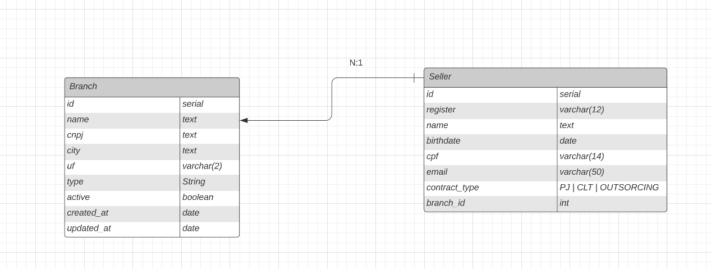
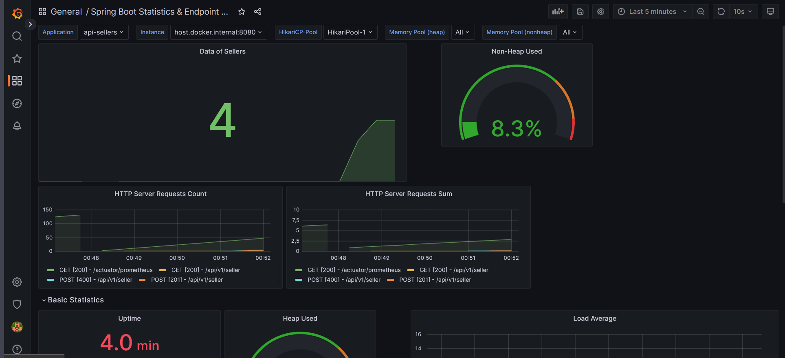
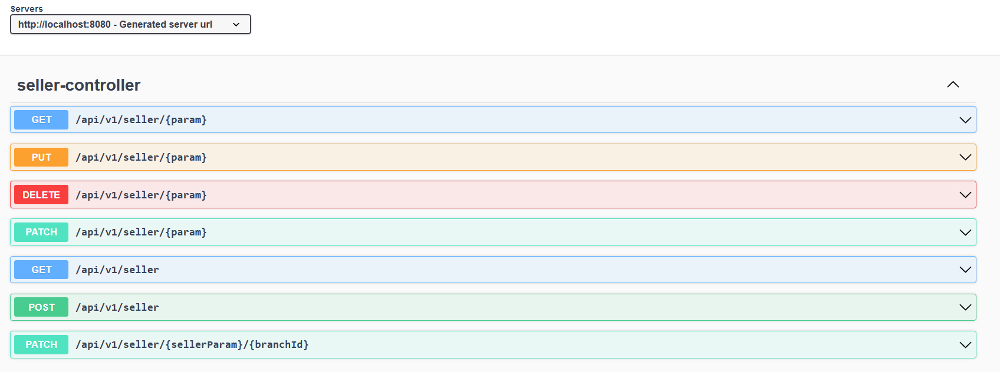

## ✨ Tecnologias

Esse projeto foi desenvolvido com as seguintes tecnologias:

- [Java 17](https://www.oracle.com/java/technologies/javase/jdk17-archive-downloads.html)
- [Spring Boot](https://start.spring.io/)
- [PostgresQL](https://www.postgresql.org/)
- [Flyway](https://flywaydb.org/)
- [Grafana](https://grafana.com/)
- [Prometheus](https://prometheus.io/)
- [Actuator](https://spring.io/guides/gs/actuator-service/)


## 🛠 Modelagem de Dados 




## 🚀 Como executar

- Tenha instalado o [Docker](https://www.docker.com/) para rodar o banco de dados da aplicação, ou pode iniciar manualmente tendo o PostgreSQL instalado.
- Tenha o [Maven](https://dicasdejava.com.br/como-instalar-o-maven-no-windows/) instalado
- Clone o repositório
- Rode `docker compose up -d` para iniciar o banco de dados no Posgres
- Rode `mvn spring-boot:run` para iniciar a aplicação

## 🔍📐 Monitoria 📊🧐

- Tendo rodado o `docker compose up -d` será iniciado também o processo de monitoria da aplicação através do Actuactor e do Prometheus.
- Acesse o [Prometheus](http://localhost:9090/) para visualizar as métricas da aplicação
- Através do [Grafana](http://localhost:3000/) é possível visualizar os gráficos das métricas, sendo disponibilizado um json com um exemplo de dashboard para visualizar os dados dentro do diretório `etc/grafana-dashboard.json`, [bastando importar o JSON no painel](http://localhost:3000/dashboard/import)



## 📝 Documentação 📝

- Para acessar o Swagger da aplicação, basta acessar o [Swagger](http://localhost:8080/swagger-ui.html) com a aplicação rodando



## Testes

```bash
# unit tests
$ mvn test
```